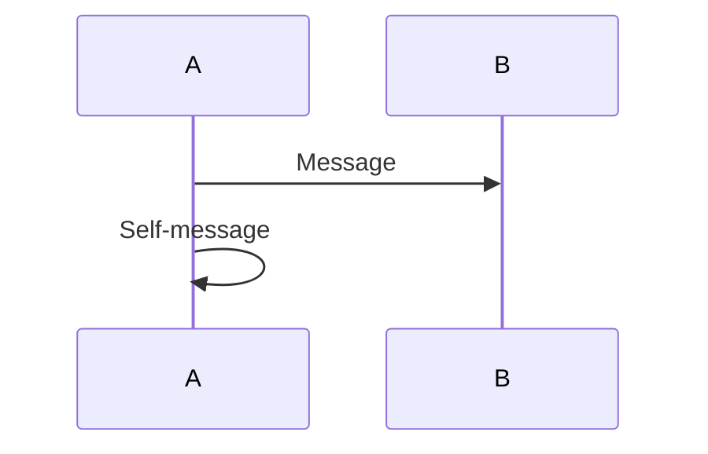
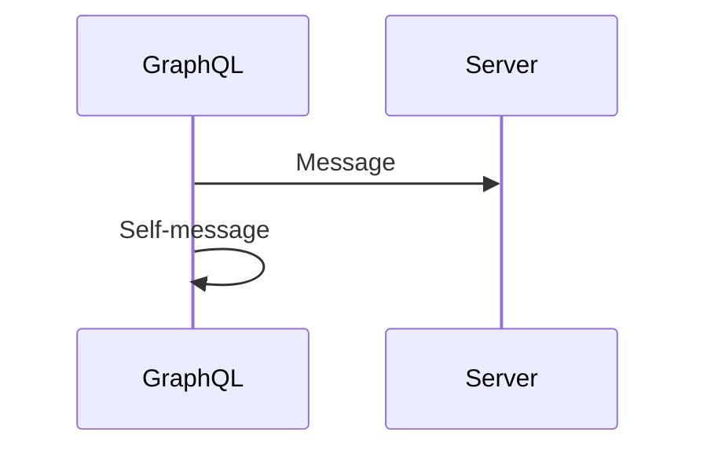
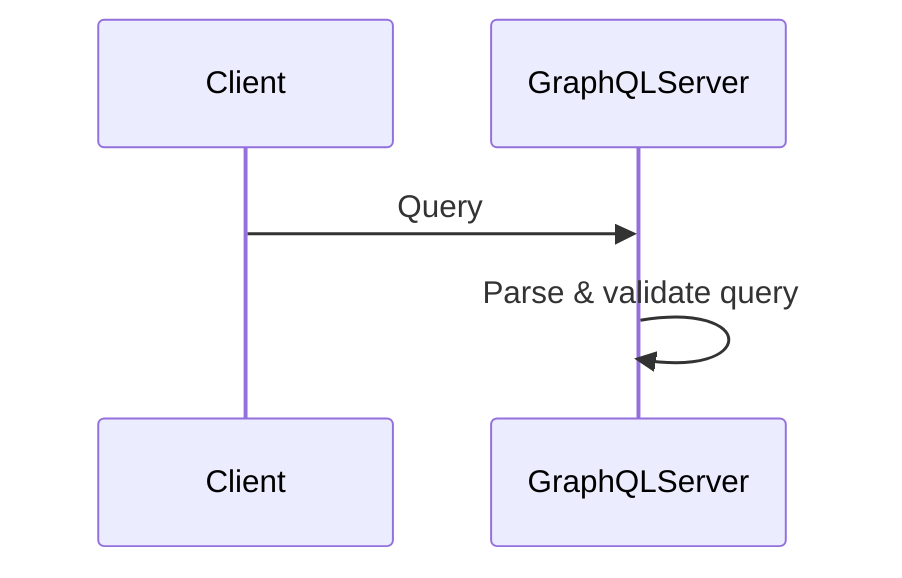

# 🔥 Parser Bug - ROOT CAUSE FOUND!

## 🎯 Bug Identified!

**Trigger**: Participant name containing certain patterns + self-message

### Reproduction Cases

#### ✅ Works Fine


#### ❌ HANGS Forever


#### ❌ ALSO HANGS


---

## 🔍 Investigation Results

### Test Matrix

| Participant Name | Self-Message After Regular Message | Result |
|-----------------|-----------------------------------|---------|
| `A` | `A->>A` | ✅ OK |
| `Server` | `Server->>Server` | ✅ OK |
| `GraphQL` | `GraphQL->>GraphQL` | ❌ **HANGS** |
| `GraphQLServer` | `GraphQLServer->>GraphQLServer` | ❌ **HANGS** |

### Key Finding

**The word "GraphQL" in participant names causes infinite loop!**

---

## 💡 Hypothesis

### Possible Causes

1. **Tokenizer Issue**: `GraphQL` might be mis-tokenized
   - Maybe `QL` is treated specially?
   - Or `-` in arrow followed by `Graph` creates weird token sequence?

2. **Parser Issue**: The combination of:
   - Participant name with `QL` pattern
   - Self-message pattern `X->>X`
   - Creates infinite loop in message parsing

3. **Keyword Conflict**: Though `GraphQL` is NOT a keyword:
   - `of` IS a keyword (line 24 in tokenizer)
   - Maybe some substring matching issue?

---

## 🔧 Debug Added

Added infinite loop guards to:
- ✅ `parseSequenceDiagram()` main loop (max 100 iterations)
- ✅ `readUntilNewline()` (max 1000 iterations)
- ✅ `skipUntilNewline()` (max 1000 iterations)
- ✅ `skipNewlines()` (max 1000 iterations)

**Result**: NO errors thrown = loop is somewhere else!

---

## 🎯 Next Steps

### Step 1: Token Stream Analysis
Need to see the actual token stream for:
```
GraphQL->>GraphQL: Text
```

vs

```
Server->>Server: Text
```

### Step 2: Identify the Exact Loop Location
Since guards didn't catch it, the loop might be in:
- Tokenizer itself
- Base parser methods (`advance()`, `match()`)
- Some recursive call we haven't guarded

### Step 3: Fix Strategy

**Option A**: Fix tokenizer if it's mis-tokenizing `GraphQL`

**Option B**: Fix parser if it's the message parsing logic

**Option C**: Add global iteration counter across all methods

---

## ⏰ Current Status

- **Bug Identified**: ✅ YES - `GraphQL` in participant name
- **Location**: ⏳ NARROWING DOWN
- **Guards Added**: ✅ YES - But didn't trigger
- **Fix**: ⏳ PENDING token analysis

---

## 🚀 Workaround

For now, users should avoid participant names containing:
- `GraphQL`
- Possibly other `...QL` patterns

Example:
```mermaid
# DON'T DO THIS
sequenceDiagram
    participant GraphQL
    GraphQL->>GraphQL: Process

# DO THIS INSTEAD
sequenceDiagram
    participant GQL
    GQL->>GQL: Process
```

---

*Investigation: 2025-11-09*  
*Status: Bug cause identified, fix in progress*  
*Next: Token stream analysis*

めっちゃ面白いバグだったわ！💡
`GraphQL`という名前が原因とは...💦

次はtoken streamを見て、正確な原因を特定するわよ～！✨
