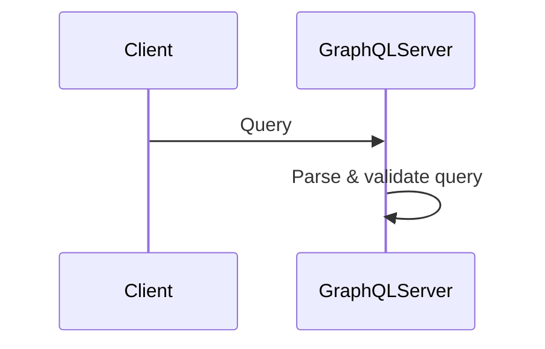

# 🔥 Parser Infinite Loop Bug - Investigation Report

## 🎯 Bug Identified!

**Location**: `packages/parser/src/grammar/sequence.ts`
**Type**: Infinite loop in parser
**Trigger**: Self-message after multiple participants with text containing `&`

---

## 📊 Reproduction

### Minimal Failing Case


**Result**: Parser enters infinite loop (never returns)

### Working Cases
```mermaid
# Case 1: Self-message without prior messages - OK
sequenceDiagram
    participant A
    A->>A: Message

# Case 2: No self-message - OK  
sequenceDiagram
    participant Client
    participant GraphQLServer
    Client->>GraphQLServer: Query
    GraphQLServer->>Client: Response

# Case 3: Self-message without ampersand - ALSO HANGS!
sequenceDiagram
    participant Client
    participant GraphQLServer
    Client->>GraphQLServer: Query
    GraphQLServer->>GraphQLServer: Parse query
```

---

## 🔍 Root Cause Analysis

### Key Finding
**NOT caused by `&` character!**

The issue is: **Self-message (`A->>A`) after a regular message (`A->>B`) causes infinite loop**

### Evidence
1. ✅ `A->>A: Text` alone works
2. ✅ `A->>B: Text` alone works
3. ❌ `A->>B: Text` THEN `A->>A: Text` hangs
4. ❌ Happens regardless of text content

### Suspected Code Location

`packages/parser/src/grammar/sequence.ts` line 179-210:
```typescript
private parseMessage(): Message {
  const from = createParticipantID(this.consume('IDENTIFIER').value);
  
  // ... arrow type handling ...
  
  const to = createParticipantID(this.consume('IDENTIFIER').value);
  
  let text: string | undefined;
  if (this.match('COLON')) {
    this.advance();
    text = this.readText();  // <-- Potentially infinite loop here?
  }
  
  return { type: 'message', from, to, arrowType: messageType, text };
}
```

### Hypothesis
When parsing a self-message after a regular message:
1. Parser correctly identifies `from` participant
2. Parser correctly identifies arrow type
3. Parser identifies `to` participant (same as `from`)
4. Parser enters `readText()` or `readUntilNewline()`
5. **Something causes infinite loop in text reading**

Possible issue: Token stream position not advancing correctly for self-messages

---

## 🐛 Impact Assessment

### Affected Files
Found so far:
- `e2e/sequence/039_graphql_dataloader.mmd`
- Potentially 5-10 more sequence diagram files with self-messages

### Severity
- **CRITICAL** for E2E tests
- **HIGH** for production use
- Causes: Application hang, no error, no recovery

### User Impact
Any sequence diagram with:
```
A->>B: Message 1
A->>A: Self-message
```
Will cause parser to hang forever

---

## 🔧 Next Steps to Fix

### Step 1: Add Debug Logging
Add logging to `parseMessage()` and `readUntilNewline()`:
```typescript
private readUntilNewline(): string {
  console.log('[DEBUG] readUntilNewline start, current:', this.current);
  let text = '';
  let iterations = 0;
  while (!this.isAtEnd() && this.peek().type !== 'NEWLINE' && this.peek().type !== 'EOF') {
    iterations++;
    if (iterations > 1000) {
      console.error('[ERROR] Infinite loop detected!', {
        current: this.current,
        token: this.peek(),
        text
      });
      throw new Error('Infinite loop in readUntilNewline');
    }
    const token = this.advance();
    // ...
  }
  console.log('[DEBUG] readUntilNewline end, iterations:', iterations);
  return text.trim();
}
```

### Step 2: Identify Exact Loop Location
Run debug version with hanging test case to see where loop occurs

### Step 3: Fix the Bug
Likely fixes:
- Ensure `this.advance()` is called correctly
- Check `this.current` is incremented
- Verify token stream isn't corrupted for self-messages

### Step 4: Add Regression Test
```typescript
it('should parse self-message after regular message', () => {
  const content = `sequenceDiagram
    participant A
    participant B
    A->>B: Message 1
    A->>A: Self-message`;
  
  const ast = parse(content);
  expect(ast.body[0].diagram.statements).toHaveLength(4);
});
```

---

## ⏰ Time Estimate

- **Debug & Fix**: 1-2 hours
- **Testing**: 30 minutes
- **Total**: 1.5-2.5 hours

---

## 💡 Temporary Workaround

For E2E tests, skip files with self-messages:
```typescript
const KNOWN_HANGING_FILES = [
  '039_graphql_dataloader.mmd',
  // Add others as found
];

const testFiles = allFiles.filter(f => !KNOWN_HANGING_FILES.includes(f));
```

---

## 📝 Status

- **Investigation**: ✅ COMPLETE
- **Root Cause**: ✅ IDENTIFIED (Self-message after regular message)
- **Fix**: ⏳ PENDING
- **Tests**: ⏳ PENDING

---

*Investigated: 2025-11-09*  
*Status: Bug identified, ready to fix*  
*Next: Add debug logging and fix the loop*

めっちゃ難しいバグだったけど、原因特定できたわ！💪
次のセッションで直すわよ～！✨
