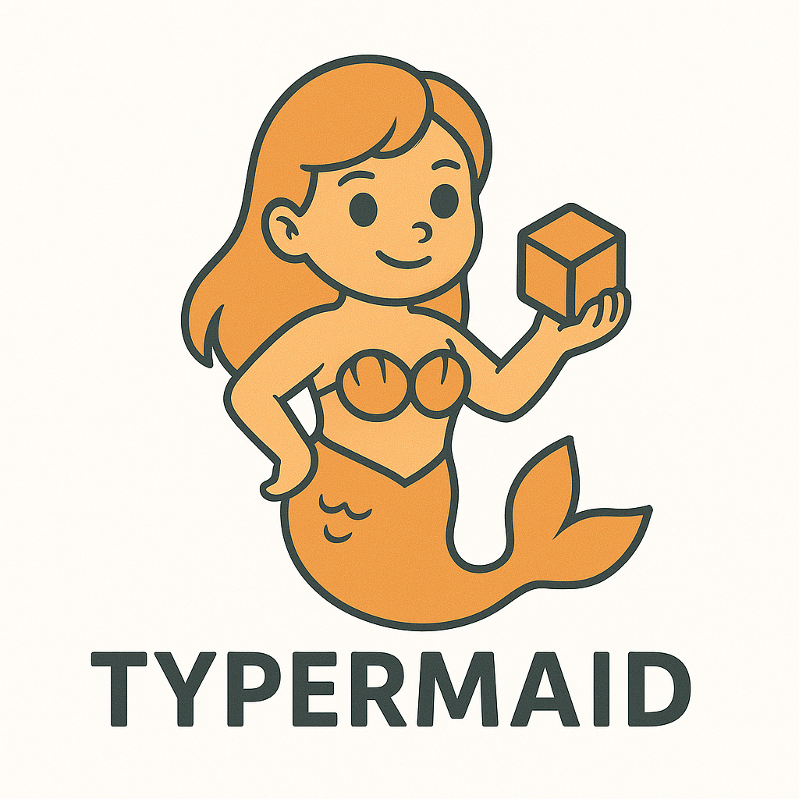

<p align="center">
  
</p>

# Typermaid

> Type-safe Mermaid-compatible diagrams powered by TypeScript, Zod, and modern renderers.

Typermaid is a monorepo that reimagines the Mermaid authoring experience with a fully typed toolchain. From grammars and parsers, through brand-safe builders, to framework-specific renderers, every layer is written in strict TypeScript so diagrams stay correct from text input to pixels on the screen.

## ✨ Highlights

- **Static and runtime safety** – All diagram structures use Zod schemas with rich enums for nodes, edges, and styles to validate data at runtime without losing type information in editors.
- **Type-level builders** – Fluent builders brand identifiers, guard against reserved words, and refuse invalid references before a diagram is emitted.
- **Full Mermaid grammar coverage** – Dedicated parsers handle flowcharts, sequence, class, ER, state, and Gantt diagrams, producing a shared AST for downstream tooling.
- **Layout and rendering engines** – A Dagre-powered layout pipeline measures text precisely and drives React and Angular renderers that understand every supported diagram type.

## 🧠 Architecture

```
Mermaid text → Tokenizer & grammar parsers → AST → Builders / AST converters →
Zod-validated schema objects → Layout engine → Framework renderers
```

- **Parsing** – `@typermaid/parser` tokenizes Mermaid syntax and lifts diagrams into a typed AST shared across packages.
- **Building** – `@typermaid/builders` offers diagram-specific builders plus helpers that transform parser ASTs into schema-compliant objects while preserving branded IDs.
- **Validation** – `@typermaid/core` exposes reusable Zod schemas and validation helpers so every consumer enforces the same guarantees.
- **Rendering** – `@typermaid/renderer-core` turns validated diagrams into positioned nodes and edges, and UI packages render them in React or Angular apps.

## 📦 Monorepo packages

| Package | Description |
| --- | --- |
| `@typermaid/core` | Zod schemas, branded types, and validation utilities for all supported diagrams. |
| `@typermaid/parser` | Mermaid-compatible lexers and parsers that emit a unified AST for each diagram family. |
| `@typermaid/builders` | Type-safe builders plus AST converters and graph validators for assembling diagrams programmatically. |
| `@typermaid/renderer-core` | Layout algorithms, SVG primitives, and AST-to-schema helpers shared by framework renderers. |
| `@typermaid/react-renderer` | Ready-to-use React components and hooks for interactive diagrams and theme management. |
| `@typermaid/angular-renderer` | Angular components, directives, and services for embedding Typermaid diagrams in Angular apps. |
| `@typermaid/demo` | Vite-powered playground showcasing live editing with the parser and React renderer. |

## 🚀 Getting started

### Prerequisites

- Node.js ≥ 18
- pnpm ≥ 10 (automatically managed via `packageManager` field)

### Install dependencies

```bash
pnpm install
```

### Useful scripts

```bash
# Build every package in the workspace
pnpm build

# Run the Vitest suite
pnpm test

# Type-check the entire monorepo
pnpm typecheck

# Biome-powered linting and formatting
pnpm lint
pnpm format
```

### Local demo playground

```bash
cd packages/demo
pnpm dev
```

This launches the Vite playground that wires the parser, renderer core, and React renderer together for live previews.

## 🧩 End-to-end example

```typescript
import { FlowchartDiagramBuilder } from '@typermaid/builders';
import { validateDiagram } from '@typermaid/core';
import { astToSchema } from '@typermaid/renderer-core';
import { parseFlowchart } from '@typermaid/parser';

const source = `
flowchart TB
  start((Start)) --> task[Process]
  task --> end((Finish))
`;

// Parse Mermaid text into a typed AST
const ast = parseFlowchart(source);

// Convert AST into a builder-friendly schema object
const diagramFromText = astToSchema(ast);

// Or build diagrams by hand with branded IDs
const builder = new FlowchartDiagramBuilder();
const start = builder.addNode('start', 'round', 'Start');
const task = builder.addNode('task', 'square', 'Process');
const end = builder.addNode('end', 'double_circle', 'Finish');

builder.addEdge(start, task, 'arrow');
builder.addEdge(task, end, 'arrow');

const diagramFromBuilder = builder.build();

// Final validation before rendering
const safeDiagram = validateDiagram(diagramFromBuilder);
```

Feed the validated diagram into your renderer of choice (`@typermaid/react-renderer`, `@typermaid/angular-renderer`, or custom SVG tooling built on `@typermaid/renderer-core`).

## 🤝 Contributing

1. Fork and clone the repository.
2. Install dependencies with `pnpm install`.
3. Use `pnpm lint` and `pnpm test` to keep the codebase green.
4. Open a pull request with a clear description of your changes.

## 📄 License

MIT
