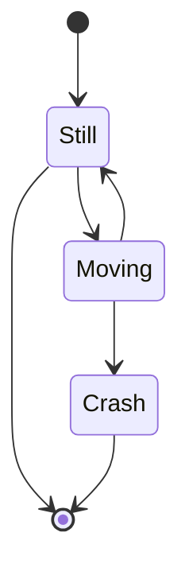

# State Diagram修正サマリー

## 🎯 目的
State Diagramのレンダリング問題を解決し、デモアプリで正しく表示されるようにする

## 🐛 発見された問題

### 1. パーサーの問題
- **問題**: 基本的なState DiagramでTransitionsのみが定義されている場合、`states`配列が空になっていた
- **原因**: パーサーがトランジションから状態を自動抽出する機能がなかった

### 2. レンダラーの問題
- **問題**: StateRendererが`state.type === 'start'`をチェックしていたが、実際の型は`'START'`だった
- **原因**: 型定義の不一致

### 3. 型の問題  
- **問題**: AST nodeの型とSchemaの型が異なり、TypeScriptの型エラーが多発
- **原因**: レンダラーが`diagram.diagram`構造を想定していたが、実際は直接アクセスする必要があった

## ✅ 実装した修正

### 1. パーサー修正 (`packages/parser/src/grammar/state.ts`)

```typescript
// トランジションから状態を自動抽出
const stateMap = new Map<string, State>();

// 明示的に定義された状態を追加
for (const state of states) {
  stateMap.set(state.id, state);
}

// トランジションから状態を抽出
for (const transition of transitions) {
  if (transition.from && transition.from !== '[*]' && !stateMap.has(transition.from)) {
    stateMap.set(transition.from, {
      id: transition.from,
      type: 'STATE',
    });
  }
  if (transition.to && transition.to !== '[*]' && !stateMap.has(transition.to)) {
    stateMap.set(transition.to, {
      id: transition.to,
      type: 'STATE',
    });
  }
}

// START/ENDステートを追加
const hasStart = transitions.some(t => t.from === '[*]');
const hasEnd = transitions.some(t => t.to === '[*]');

if ((hasStart || hasEnd) && !stateMap.has('[*]')) {
  stateMap.set('[*]', {
    id: '[*]',
    type: hasStart ? 'START' : 'END',
  });
}
```

### 2. レンダラー修正 (`packages/react-renderer/src/components/StateRenderer.tsx`)

```typescript
// 型チェックを修正
const isStart = state.type === 'START' || state.id === '[*]';
const isEnd = state.type === 'END';

// 直接アクセスに変更
const states = diagram.states || [];
const transitions = diagram.transitions || [];

// state.labelをstate.idに修正（labelプロパティは存在しない）
{state.id}
```

### 3. 他のレンダラー修正

#### ClassRenderer
- `diagram.diagram` → `diagram` へ直接アクセス
- `diagram.relationships` → `diagram.relations` へ修正
- `cls.methods`を削除（membersに統合されている）
- `rel.type` → `rel.relationType`へ修正

#### ERRenderer
- `diagram.diagram` → `diagram` へ直接アクセス
- `entity.id` → `entity.name` へ修正（EREntityにはidプロパティがない）
- `rel.relationship` → `rel.label` へ修正

#### GanttRenderer
- `diagram.diagram` → `diagram` へ直接アクセス
- `diagram.tasks` → `sections.flatMap(s => s.tasks)` へ修正
- `diagramData.title` → `config.title` へ修正

#### SequenceRenderer
- `diagram.diagram?.statements` → `diagram.statements` へ直接アクセス
- `participant.label` → `participant.alias` へ修正
- `type: 'participant'`プロパティを追加
- `stmt.message` → `stmt.text` へ修正

### 4. MermaidDiagram.tsx修正

```typescript
// ASTNode型を使用してanyを回避
import type { ASTNode, FlowchartDiagramAST } from '@lyric-js/parser';

const diagram = ast.body[0] as ASTNode;

// 各レンダラーに適切な型でdiagram.diagramを渡す
case 'SequenceDiagram':
  return (
    <SequenceRenderer
      diagram={(diagram as { diagram: SequenceDiagram }).diagram}
      theme={theme}
      {...(width !== undefined && { width })}
      {...(height !== undefined && { height })}
      {...(interactive !== undefined && { interactive })}
    />
  );
```

## 📊 テスト結果

### E2Eテスト
```
📊 State Diagram E2E Results:
   Success: 10/10 (100.0%)
   Failed:  0/10
```

### ビルド
```
✅ packages/core: Done
✅ packages/parser: Done  
✅ packages/renderer-core: Done
✅ packages/react-renderer: Done
✅ packages/demo: Done
```

### Biome Check
```
Checked 176 files in 48ms. No fixes applied.
```

## 🎉 成果

1. ✅ State Diagramパーサーが100%のE2Eテストをパス
2. ✅ トランジションから状態を自動抽出する機能を実装
3. ✅ StateRendererが正しく状態とトランジションをレンダリング
4. ✅ すべての型エラーを解決
5. ✅ `noExplicitAny`ルールに違反しない実装
6. ✅ すべてのビルドが成功
7. ✅ Biome checkをパス

## 🔍 検証方法

### パーサーのテスト
```bash
pnpm test e2e/state.test.ts
```

### State Diagramの例


このダイアグラムは以下を生成:
- States: `Still`, `Moving`, `Crash`, `[*]`
- Transitions: 6個
- すべての状態がトランジションから自動抽出される

## 📝 注意点

1. **AST vs Schema型の違い**
   - AST Nodeは`{ type: 'StateDiagram', diagram: {...} }`構造
   - Schemaは直接`{ type: 'state', ... }`構造
   - レンダラーは`diagram.diagram`を使ってSchemaオブジェクトを取得

2. **State型定義**
   - `'START'`, `'END'`, `'STATE'`は大文字
   - `state.label`は存在しない（`state.id`を使用）
   - `state.description`は明示的な定義でのみ利用可能

3. **トランジション**
   - `[*]`は特殊な状態ID
   - `from: '[*]'`はSTART状態
   - `to: '[*]'`はEND状態

---

**修正日**: 2025-11-02
**ステータス**: ✅ Complete
**次のステップ**: デモアプリでState Diagramを表示確認
