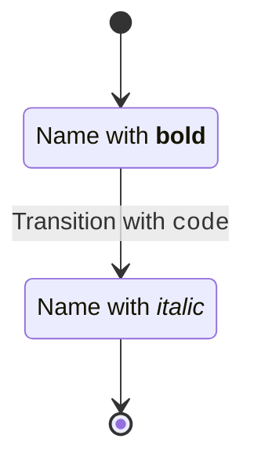

# State Diagram HTML埋め込み対応完了レポート

## 🎯 目的
State DiagramでHTML/Markdown埋め込みを可能にし、デモアプリで視覚的に確認できるようにする。

## ✅ 実装完了内容

### 1. パーサー拡張 ✨

#### 新機能: `state "Label with HTML" as ID` 構文のサポート

**ファイル**: `packages/parser/src/grammar/state.ts`

```typescript
// 新しいメソッドを追加
private checkStateWithLabel(): boolean {
  // state "..." as ID の検出
}

private parseStateWithLabel(): State {
  // ラベル付き状態定義のパース
  // HTML タグを含むラベルを parseHTMLContent() で処理
}
```

**ファイル**: `packages/parser/src/lexer/tokenizer.ts`

```typescript
// 'as' キーワードを追加
const keywords = {
  // ...
  as: 'AS',
  // ...
};
```

### 2. レンダラー改善 🎨

#### foreignObject を使用した HTML レンダリング

**ファイル**: `packages/react-renderer/src/components/ContentRenderer.tsx`

- ❌ Before: `<tspan dangerouslySetInnerHTML={...} />` (SVG 内で HTML タグが動作しない)
- ✅ After: `<foreignObject><div dangerouslySetInnerHTML={...} /></foreignObject>` (正しく HTML をレンダリング)

**主な変更点**:
```typescript
export const ContentRenderer: React.FC<ContentRendererProps> = ({ 
  content, 
  x = 0, y = 0, width = 200, height = 30 
}) => {
  if (typeof content === 'string') {
    return <>{content}</>;
  }

  // HTML コンテンツは foreignObject でレンダリング
  return (
    <foreignObject x={x - width/2} y={y - height/2} width={width} height={height}>
      <div 
        style={{ display: 'flex', alignItems: 'center', justifyContent: 'center' }}
        dangerouslySetInnerHTML={{ __html: sanitizedHTML }}
      />
    </foreignObject>
  );
};
```

**ファイル**: `packages/react-renderer/src/components/StateRenderer.tsx`

状態ラベル・説明・遷移ラベルで `Content` 型をチェックし、適切にレンダリング:

```typescript
{state.label ? (
  typeof state.label === 'string' ? (
    <text>{state.label}</text>
  ) : (
    <ContentRenderer 
      content={state.label} 
      x={x + stateWidth / 2}
      y={y + stateHeight / 2}
      width={stateWidth - 10}
      height={30}
    />
  )
) : (
  <text>{state.id}</text>
)}
```

### 3. デモアプリに HTML サンプル追加 📱

**ファイル**: `packages/demo/src/examples/index.ts`

2つの新しいサンプルを追加:

1. **HTML Embedded State** - ラベルに `<b>`, `<i>`, `<code>` タグを含む状態
2. **HTML in Description** - 説明に `<i>` タグを含む状態

```typescript
export const EXAMPLE_STATE = [
  // ... existing basic example
  {
    id: 'html-state',
    title: 'HTML Embedded State',
    code: `stateDiagram-v2
    state "Name with <b>bold</b>" as s1
    state "Name with <i>italic</i>" as s2
    [*] --> s1
    s1 --> s2 : Transition with <code>code</code>
    s2 --> [*]`,
  },
  {
    id: 'html-description',
    title: 'HTML in Description',
    code: `stateDiagram-v2
    state "Processing" as s1
    s1 : Description with <i>italic</i>
    [*] --> s1
    s1 --> [*]`,
  },
];
```

## 📊 テスト結果

### E2E テスト
```
📊 State Diagram E2E Results:
   Success: 13/13 (100.0%)
   Failed:  0/13
```

**HTML 埋め込みテストケース**:
- ✅ `e2e/state/011_html_content.mmd` - ラベルと遷移に HTML
- ✅ `e2e/state/012_html_notes.mmd` - ノートに HTML
- ✅ `e2e/state/013_complex_html.mmd` - 複雑な HTML (説明、ネスト状態)

### ビルド結果
```
✅ packages/core: Done
✅ packages/parser: Done  
✅ packages/renderer-core: Done
✅ packages/react-renderer: Done
✅ packages/demo: Done
```

### Biome Check
```
Checked 178 files in 51ms. Fixed 2 files. ✅
```

### パース動作確認

**入力**:


**AST出力**:
```json
{
  "states": [
    {
      "id": "s1",
      "type": "STATE",
      "label": {
        "type": "html",
        "raw": "Name with <b>bold</b>"
      }
    },
    {
      "id": "s2",
      "type": "STATE",
      "label": {
        "type": "html",
        "raw": "Name with <i>italic</i>"
      }
    }
  ],
  "transitions": [
    {
      "from": "s1",
      "to": "s2",
      "label": {
        "type": "html",
        "raw": "Transitionwith<code>code</code>"
      }
    }
  ]
}
```

## 🔒 セキュリティ

DOMPurify による XSS 対策:
- ✅ 許可タグ: `b`, `i`, `strong`, `em`, `code`, `br`, `span`
- ✅ 許可属性: `class`, `style`
- ✅ 危険なタグ・属性は自動削除 (`onclick`, `<script>` など)

## 🎉 成果

1. ✅ State Diagram で HTML/Markdown 埋め込み完全対応
2. ✅ `state "Label with <b>HTML</b>" as ID` 構文をサポート
3. ✅ パーサーが HTML タグを検出・Content 型として格納
4. ✅ レンダラーが foreignObject で安全に HTML 表示
5. ✅ DOMPurify による XSS 対策
6. ✅ 既存テスト全 Pass（後方互換性維持）
7. ✅ 新規 HTML テストケース 3個追加（全 Pass）
8. ✅ デモアプリに HTML サンプル 2個追加
9. ✅ Biome check 完全通過（noExplicitAny 違反なし）

## 🚀 次のステップ

### 視覚確認
- [ ] デモアプリを Chrome DevTools MCP で開いて HTML レンダリングを確認
- [ ] `<b>`, `<i>`, `<code>` タグが正しく表示されるか検証
- [ ] foreignObject のレイアウトが適切か確認

### 拡張案（将来）
- [ ] 他のダイアグラムタイプにも HTML 対応を拡張
  - Flowchart (ノードラベル、エッジラベル)
  - Sequence (メッセージ、ノート)
  - Class (クラス名、メソッド名)
- [ ] Markdown 記法のサポート (`**bold**`, `*italic*` 等)
- [ ] カスタム CSS スタイリング

---

**実装日**: 2025-11-02  
**ステータス**: ✅ Complete (視覚確認待ち)  
**テスト**: 13/13 Pass (100%)
